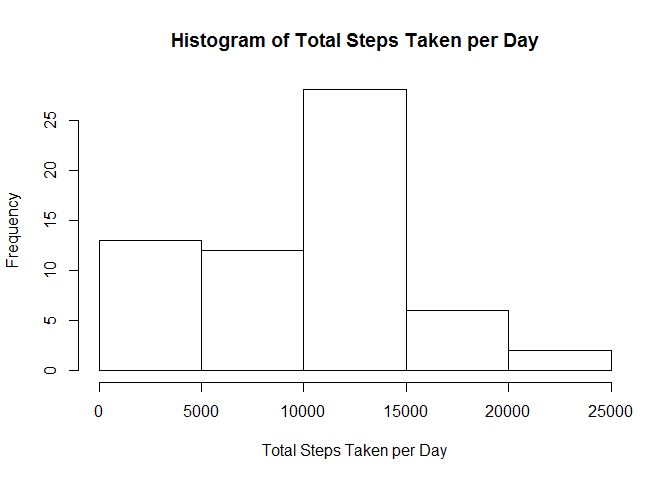
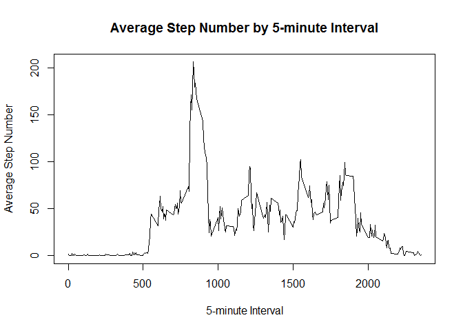
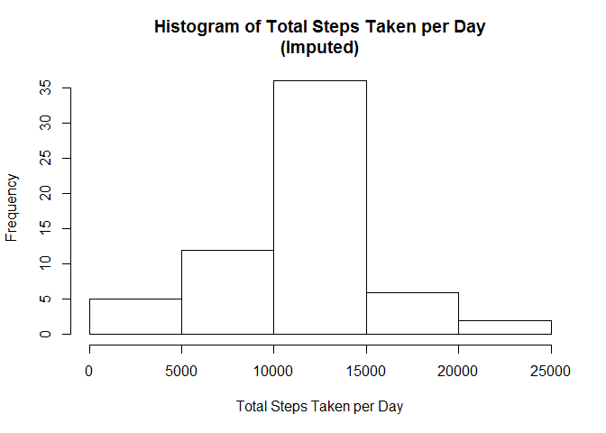
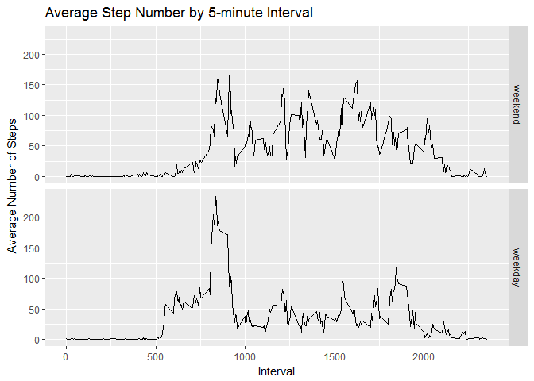

# Reproducible Research: Peer Assessment 1


## Loading and preprocessing the data

```r
x <- read.csv("./activity.csv")
```

## What is mean total number of steps taken per day?

```r
agg <- aggregate(x$steps, by=list(Date=x$date), FUN=sum, na.rm=TRUE)
hist(agg$x,xlab="Total Steps Taken per Day",main="Histogram of Total Steps Taken per Day")
```

<!-- -->

```r
mean_steps_byday <- mean(agg$x)
median_steps_byday <- median(agg$x)
mean_steps_byday
```

```
## [1] 9354.23
```

```r
median_steps_byday
```

```
## [1] 10395
```

## What is the average daily activity pattern?

```r
agg2 <- aggregate(x$steps,by=list(Interval = x$interval), FUN=mean, na.rm=TRUE)
plot(agg2$Interval, agg2$x, type="l", ylab="Average Step Number", xlab="5-minute Interval",
     main="Average Step Number by 5-minute Interval")
```

<!-- -->

```r
max_interval <- agg2[agg2$x == max(agg2$x),][1,1]
max_interval
```

```
## [1] 835
```

## Imputing missing values

```r
require(Hmisc)
```

```
## Loading required package: Hmisc
```

```
## Warning: package 'Hmisc' was built under R version 3.3.3
```

```
## Loading required package: lattice
```

```
## Warning: package 'lattice' was built under R version 3.3.3
```

```
## Loading required package: survival
```

```
## Warning: package 'survival' was built under R version 3.3.3
```

```
## Loading required package: Formula
```

```
## Loading required package: ggplot2
```

```
## 
## Attaching package: 'Hmisc'
```

```
## The following objects are masked from 'package:base':
## 
##     format.pval, round.POSIXt, trunc.POSIXt, units
```

```r
NA_values <- sum(is.na(x$steps))
NA_values
```

```
## [1] 2304
```

```r
# Data is imputed using the impute() function of the Hmisc package.  See ?impute for details.
y <- impute(x$steps, mean)
x_i <- as.data.frame(cbind(y, x$date, x$interval))
names(x_i) <- names(x)
agg3 <- aggregate(x_i$steps, by=list(Date=x_i$date), FUN=sum)
agg3$x <- as.integer(agg3$x)
hist(agg3$x,xlab="Total Steps Taken per Day",main="Histogram of Total Steps Taken per Day\n(Imputed)")
```

<!-- -->

```r
mean_steps_byday_i <- mean(agg3$x)
median_steps_byday_i <- median(agg3$x)
mean_steps_byday_i
```

```
## [1] 10766.16
```

```r
median_steps_byday_i
```

```
## [1] 10766
```

## Are there differences in activity patterns between weekdays and weekends?

```r
require(ggplot2)
require(dplyr)
```

```
## Loading required package: dplyr
```

```
## Warning: package 'dplyr' was built under R version 3.3.3
```

```
## 
## Attaching package: 'dplyr'
```

```
## The following objects are masked from 'package:Hmisc':
## 
##     combine, src, summarize
```

```
## The following objects are masked from 'package:stats':
## 
##     filter, lag
```

```
## The following objects are masked from 'package:base':
## 
##     intersect, setdiff, setequal, union
```

```r
x <- mutate(x, weekday = weekdays(as.Date(date, "%Y-%m-%d")))
x$weekday <- factor(x = x$weekday %in% c("Saturday", "Sunday"), levels=c(TRUE,FALSE), labels=c("weekend","weekday"))
agg4 <- aggregate(x$steps, by=list(Interval = x$interval, Day = x$weekday), FUN=mean, na.rm=TRUE)
ggplot(data=agg4, aes(Interval,x)) + geom_line() + facet_grid(agg4$Day ~ .) + 
    labs(x="Interval", y = "Average Number of Steps", title = "Average Step Number by 5-minute Interval")
```

<!-- -->
